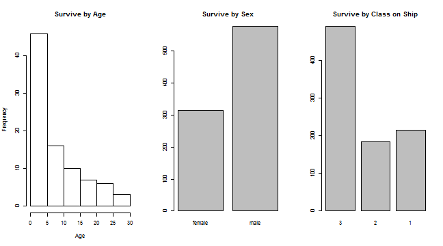

Developing Data Products Peer Assessment - Coursera
========================================================
author: Luiz Fernando da Silva
date: sep/2015


Introducing, my Shiny App
========================================================

For the first part of this assessment I developed a simple
Shiny app that predict if a person have survived to Titanic
sinking.

You can see the running here:
https://folksilva.shinyapps.io/devdataprod-shinyApp

And the source code is here:
https://github.com/folksilva/devdataprod-shinyApp

The Data
========================================================

The application has developed with Kaggle Competition 
Titanic Data, more especific with the train csv file.

You can see more about the data here:
https://www.kaggle.com/c/titanic/data

And more about the Kaggle Competition here:
https://www.kaggle.com/c/titanic

The Prediction Model
========================================================

See below the code that I used to create the model.

```r
trainData <- read.table('train.csv', header = TRUE, sep = ',')
trainData$Pclass <- factor(trainData$Pclass, levels = c(3,2,1), ordered = TRUE)
model <- glm(Survived ~ Pclass + Sex + Age, family=binomial(), data=trainData)
```

This model have a problem, but for purpose of the 
application it's fine. The Age variable have too much NA:


```
   Min. 1st Qu.  Median    Mean 3rd Qu.    Max.    NA's 
   0.42   20.12   28.00   29.70   38.00   80.00     177 
```

Overview of the Data
========================================================

Look to some detais about the Data:

 
